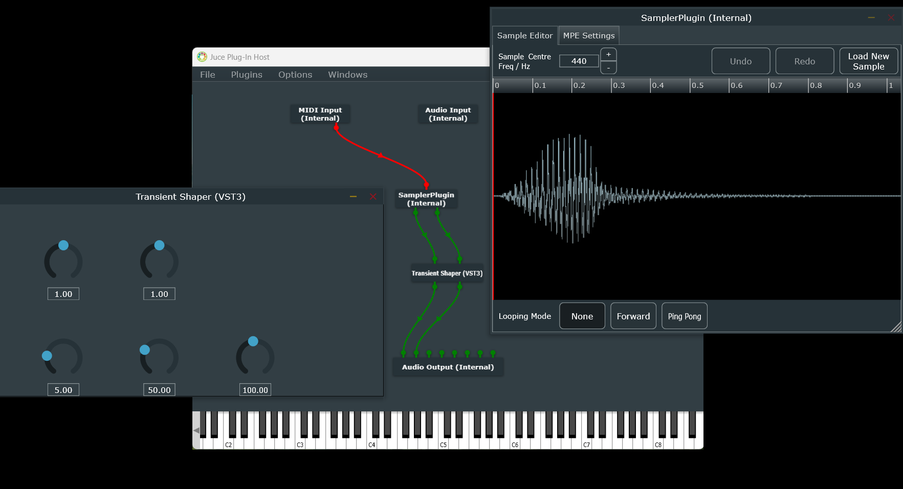

<!---
## [](https://github.com/sudara/pamplejuce/actions)
--->

Welcome hackers and cheapskates. You could have just bought the plugin directly from us, but maybe you didn't want to pay, or maybe you just thought the the range of sounds available from this plugin in its stock form are too limited, so now here we are, have it at. Building with CMake is a fairly steep learning curve to get to grips with, as is C++ development, but luckily it's all spelt out for you below.

This is the 'Whipper Snapper' your one stop shop for punchy drums. 

Intended for multi platform development. On Windows, [VS2022](https://visualstudio.microsoft.com/downloads/) can be used as an IDE, or simply for the C++ compiler, just ensure that C++ desktop development package, with the optional C++ CMake tools for Windows selected, is installed. This will give you everything you need to configure and build CMake projects.
Simply open the WhipperSnapper folder in VS2022, and any edit to the CMakeLists file will automagically trigger the cmake configure step. It may be necessary to install [Intel IPP](https://www.intel.com/content/www/us/en/developer/tools/oneapi/ipp.html#gs.cykfky) in the future, but for now, since the PamplejuceIPP variable has been commented out in the CMakeLists.txt file, it should not be needed.

## Preferred Build and Debug Environment

VS Code offers a transparent build and debug environment (for free, you cheapskates), and is available for Windows, Mac and Linux, so it is our preferred tool. 

### Windows Environment

Configuring VS Code to build and debug the project is a matter of installing some extensions and writing the '**launch.json**' and '**settings.json**' files in the **.vscode** folder. These are machine specific, so are not included as part of the repo, but a specific config can be found below as a guide.

#### launch.json
```json
{
  "version": "0.2.0",
  "configurations": [
      {
          "name": "Debug VST in AudioPluginHost",
          "type": "cppvsdbg",
          "request": "launch",
          "program": "${workspaceFolder}/build/JUCE/extras/AudioPluginHost/AudioPluginHost_artefacts/Debug/AudioPluginHost.exe", 
          "args": ["--plugin", "${workspaceFolder}/build/WhipperSnapper_artefacts/Debug/VST3/Whipper Snapper.vst3"],  
          "stopAtEntry": false,
          "cwd": "${workspaceFolder}",
          "environment": [],
          "externalConsole": false
      }
  ]
}
```

#### settings.json
```json
{
    "cmake.cmakePath": "C:/Program Files/Cmake/bin/cmake.exe",  // Adjust this to your system's path
    "cmake.generator": "Ninja",
    "dotnet.defaultSolution": "disable", // Or "Unix Makefiles" or "Visual Studio 16 2019", depending on your environment
}
```
The extension **C/C++ Extension Pack** can be installed, as it contains all the individual extensions required to build and debug cmake projects: C/C++, CMake, and CMake tools.

Out of the box, some magic starts happening, blink and you'll miss it. The CMake tool will try to run the cmake configure step, which may or may not be exactly what we want. An example of a good configure step on Windows is as follows.

    "C:/Program Files/Cmake/bin/cmake.exe" -DCMAKE_BUILD_TYPE:STRING=Debug -DCMAKE_EXPORT_COMPILE_COMMANDS:BOOL=TRUE --no-warn-unused-cli -SC:/WhipperSnapper -Bc:/WhipperSnapper/build -G Ninja

This will put the CMakeCache.txt file, and other files necessary to build the project, into the build folder, thanks to the -Bc:WhipperSnapper/build argument, which is handy, since this folder is gitignored. It also specifies Ninja as the builder, which is the most lightweight of build options. Certainly on Windows we want to avoid vcxproj files being generated, since that may tempt us to open them up in Visual Studio, and edit files that will not / cannot be committed to this repo. It may be necessary to [install Ninja](https://github.com/ninja-build/ninja/wiki/Pre-built-Ninja-packages) separately.

The build process for the various targets, such as the VST3, can be launched using the CMake Tools on Visual Studio Code, which on Windows translates to the following commands.

    "C:/Program Files/Microsoft Visual Studio/2022/Community/VC/Auxiliary/Build/vcvarsall.bat" x64
    "C:/Program Files/Cmake/bin/cmake.exe" --build c:/WhipperSnapper/build --config Debug --target WhipperSnapper_VST3

If this runs successfully, then you should see in the output that the VST3 file has been installed in the standard VST3 folder for your machine, and you can open the DAW of your choosing and find the newly built plugin. If this is all you came for, you can make a run for it now, although I should note that it would be better to figure out how to build the release configuration, since that will run a little more efficiently.

#### Debug Environment
If you're messing with the design, it's likely you'll need to do some debugging. A lightweight and convenient way to do this is to connect the generated debug build VST3 to the JUCE AudioPluginHost, as alluded to in the launch.json file above. To do this we need to re-run the CMake configure step to add the AudioPluginHost as a build target, then build the tool.

    "C:/Program Files/Cmake/bin/cmake.exe" -DCMAKE_BUILD_TYPE:STRING=Debug -DCMAKE_EXPORT_COMPILE_COMMANDS:BOOL=TRUE -DJUCE_BUILD_EXTRAS:BOOL=ON --no-warn-unused-cli -SC:/WhipperSnapper -Bc:/WhipperSnapper/build -G Ninja
    "C:/Program Files/Microsoft Visual Studio/2022/Community/VC/Auxiliary/Build/vcvarsall.bat" x64
    "C:/Program Files/Cmake/bin/cmake.exe" --build c:/WhipperSnapper/build --target AudioPluginHost

The AudioPluginHost should then be available at the location used in the launch.json file example above, and we can launch the debug task. The AudioPluginHost should appear when this task is launched, but the AudioPluginHost will not be yet be configured. Press ctrl+p to navigate to the list of available plugins, then click options -> scan for new or updated VST3 plugins. The folder "C:/WhipperSnapper/build/WhipperSnapper_artefacts/Debug/VST3" should be visible, and you can click scan. After this, create and connect the plugins as in the screenshot.



Save this confuration so that it loads automatically the next time the debug task is run. It is possible to click and drag your own preferred sample into the sampler plugin, then just trigger the sample with your MIDI device of choice, and play with the plugin. A breakpoint can be set by selecting the line of code that you are interested in in VS Code.

### Mac Environment

Configuring VS Code to build and debug the project on macOS involves installing some extensions, setting up your environment, and writing the necessary `launch.json` and `settings.json` files in the `.vscode` folder. These are machine-specific, so they are not included as part of the repo. A specific configuration for macOS is provided below as a guide.

#### Step 1: Install CMake and Ninja

On macOS, you'll need to install **CMake** and **Ninja** to handle the build process. The easiest way to do this is through **Homebrew**. If you don't have Homebrew installed, first install it by running this command in the terminal:

```bash
/bin/bash -c "$(curl -fsSL https://raw.githubusercontent.com/Homebrew/install/HEAD/install.sh)"
```

Once Homebrew is installed, you can install CMake and Ninja with the following commands:

```bash
brew install cmake
brew install ninja
```

#### Step 2: Install Extensions in VS Code

Make sure to install the necessary extensions for working with CMake and C++ in VS Code.

1. **CMake Tools** – for configuring and building CMake projects.
2. **C/C++ Extension Pack** – includes C++ language support and debugging tools.

You can install these extensions by searching for them in the Extensions view in VS Code (`Cmd + Shift + X`).

#### Step 3: Configure VS Code for CMake

To properly configure your CMake build environment in VS Code, you’ll need to set up a few files in the `.vscode` folder of your project.

#### launch.json
```json
{
  "version": "0.2.0",
  "configurations": [
      {
          "name": "Debug VST in AudioPluginHost",
          "type": "cppdbg",
          "request": "launch",
          "program": "${workspaceFolder}/build/JUCE/extras/AudioPluginHost/AudioPluginHost_artefacts/Debug/AudioPluginHost", 
          "args": ["--plugin", "${workspaceFolder}/build/WhipperSnapper_artefacts/Debug/VST3/Whipper Snapper.vst3"],  
          "stopAtEntry": false,
          "cwd": "${workspaceFolder}",
          "environment": [],
          "externalConsole": false
      }
  ]
}
```

#### settings.json
```json
{
    "cmake.cmakePath": "/usr/local/bin/cmake",  // Adjust this to your system's path, if necessary
    "cmake.generator": "Ninja",  // If you're using Ninja, specify it here
    "cmake.buildDirectory": "${workspaceFolder}/build"
}
```

#### Step 4: Running CMake Configuration

With the necessary tools installed and the configuration files set, you can now run the CMake configure step:

1. **Open the Command Palette** in VS Code (`Cmd + Shift + P`).
2. Type `CMake: Configure` and select it.
3. CMake will generate the build files in your specified `build` folder.

If everything is set up correctly, CMake will configure your project and generate the necessary files to proceed with building the project.

Here’s an example of a good CMake configuration step on macOS, which will be visible in the output window:

```bash
cmake -DCMAKE_BUILD_TYPE=Debug -DCMAKE_EXPORT_COMPILE_COMMANDS=TRUE -S ./WhipperSnapper -B ./build -G Ninja
```

By using Ninja, it will ensure the build is optimized and doesn't generate unnecessary project files (such as Xcode project files).

#### Step 5: Build the Project

Once the configuration step is complete, you can build the project.

1. Open the Command Palette again (`Cmd + Shift + P`).
2. Select `CMake: Build` to compile the project.

This will use the Ninja generator (or your specified generator) to build the project based on the configuration. If this runs successfully, then you should see in the output that the VST3 file has been installed in the standard VST3 folder for your machine, and you can open the DAW of your choosing and find the newly built plugin. If this is all you came for, you can make a run for it now, although I should note that it would be better to figure out how to build the release configuration, since that will run a little more efficiently.

#### Step 6: Debugging with AudioPluginHost

To debug your VST plugin in the **JUCE AudioPluginHost**, you’ll need to configure the build process to include AudioPluginHost as a target. Follow these steps:

1. Re-run the CMake configure step with extra parameters to build AudioPluginHost:
   ```bash
   cmake -DCMAKE_BUILD_TYPE=Debug -DCMAKE_EXPORT_COMPILE_COMMANDS=TRUE -DJUCE_BUILD_EXTRAS=ON -S ./WhipperSnapper -B ./build -G Ninja
   ```
2. Build AudioPluginHost:
   ```bash
   cmake --build ./build --target AudioPluginHost
   ```

Once AudioPluginHost is built, you can launch the debug configuration using `launch.json` as described earlier.

#### Step 7: Launching the Debug Environment

After setting up the `launch.json` and building AudioPluginHost, you can:

1. **Launch the Debug Configuration** by selecting the debug task in VS Code (`F5`).
2. The AudioPluginHost will launch, but it won’t be configured yet. Press `Cmd + P` to open the plugin manager, then navigate to `Options -> Scan for new or updated VST3 plugins`.
3. Locate the `VST3` folder where the plugin was built (`${workspaceFolder}/build/WhipperSnapper_artefacts/Debug/VST3`) and click `Scan`.
4. Once the VST3 plugin is found, you can connect it within the AudioPluginHost as in the screenshot.


Save this confuration so that it loads automatically the next time the debug task is run. It is possible to click and drag your own preferred sample into the sampler plugin, then just trigger the sample with your MIDI device of choice, and play with the plugin. A breakpoint can be set by selecting the line of code that you are interested in in VS Code.


# Credit Where Credit is Due
A _lot_ of credit is owed to the [Pamplejuce](https://github.com/sudara/pamplejuce) template project, without which, getting started on our plugin development journey would have been significantly more difficult. For any additional information, technology behind, or just a fun read, check out the blog by its creator [Melatonin](https://melatonin.dev/blog/).

